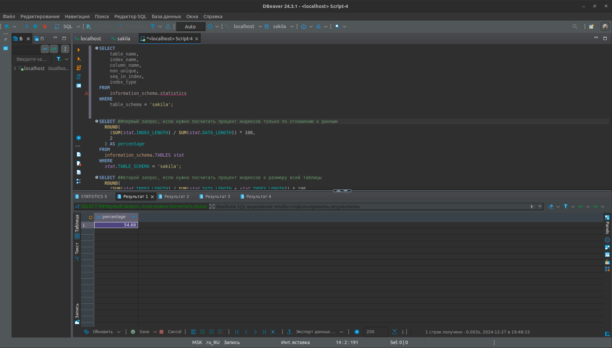
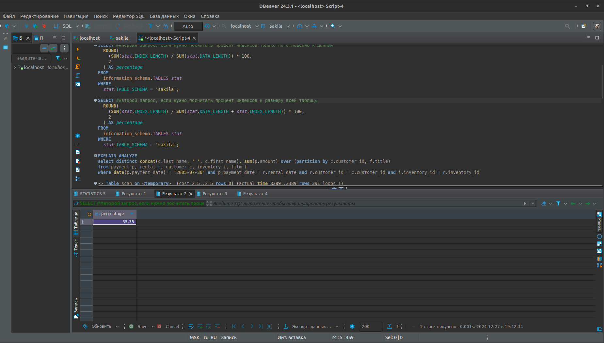

# Домашнее задание к занятию «Индексы» Dmitry Kolb

### Задание 1

Напишите запрос к учебной базе данных, который вернёт процентное отношение общего размера всех индексов к общему размеру всех таблиц.

**решение** 
немного не понял что именно нужно посчитать поэтому выполнил два запроса, а именно:
* первый запрос, если нужно посчитать процент индексов только по отношению к данным:

```sql
SELECT
  ROUND((SUM(stat.INDEX_LENGTH) / SUM(stat.DATA_LENGTH)) * 100, 2) AS percentage 
FROM 
  information_schema.TABLES stat
WHERE 
  stat.TABLE_SCHEMA = 'sakila';
```



* второй запрос, если нужно посчитать процент индексов к размеру всей таблицы:
```sql
SELECT ##второй запрос, если нужно посчитать процент индексов к размеру всей таблицы
  ROUND((SUM(stat.INDEX_LENGTH) / SUM(stat.DATA_LENGTH + stat.INDEX_LENGTH)) * 100, 2) AS percentage 
FROM 
  information_schema.TABLES stat
WHERE 
  stat.TABLE_SCHEMA = 'sakila';

```


### Задание 2

Выполните explain analyze следующего запроса:
```sql
select distinct concat(c.last_name, ' ', c.first_name), sum(p.amount) over (partition by c.customer_id, f.title)
from payment p, rental r, customer c, inventory i, film f
where date(p.payment_date) = '2005-07-30' and p.payment_date = r.rental_date and r.customer_id = c.customer_id and i.inventory_id = r.inventory_id
```
- перечислите узкие места;
- оптимизируйте запрос: внесите корректировки по использованию операторов, при необходимости добавьте индексы.
